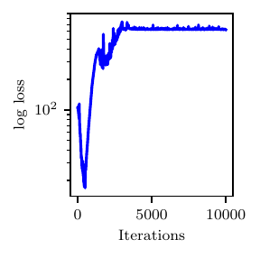
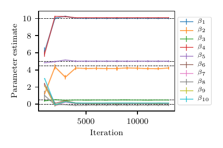

Friedman 1 model
================

We consider a modified version of the Friedman 1 dataset :cite:t:`friedman1991multivariate` to examine the performance of  our adaptive annealing scheduler in a high-dimensional context. According to the original model in :cite:t:`friedman1991multivariate`, the data are generated as

.. math::
   \textstyle y_i = \mu_i(\boldsymbol{\beta})+ \epsilon_i, \mbox{ where }
   \mu_i(\boldsymbol{\beta})=\beta_1\text{sin}(\pi x_{i,1}x_{i,2})+ \beta_2(x_{i,3}-\beta_3)^2+\sum_{j=4}^{10}\beta_jx_{i,j}, 
   :label: eqn:friedman1

where :math:`\epsilon_i\sim\mathcal{N}(0,1)`. We made a slight modification to the model in :eq:`eqn:friedman1` as

.. math::
   \mu_i(\boldsymbol{\beta}) = \textstyle \beta_1\text{sin}(\pi x_{i,1}x_{i,2})+ \beta_2^2(x_{i,3}-\beta_3)^2+\sum_{j=4}^{10}\beta_jx_{i,j},
   :label: eqn:friedman1_modified

and set the true parameter combination to :math:`\boldsymbol{\beta}=(\beta_1,\ldots,\beta_{10})=(10,\pm \sqrt{20}, 0.5, 10, 5, 0, 0, 0, 0, 0)`. Note that both :eq:`eqn:friedman1` and :eq:`eqn:friedman1_modified` contain linear, non-linear, and interaction terms of the input variables :math:`X_1` to :math:`X_{10}`, five of which (:math:`X_6` to :math:`X_{10}`) are irrelevant to :math:`Y`. 
Each :math:`X` is drawn independently from :math:`\mathcal{U}(0,1)`. We used R package `tgp` :cite:t:`gramacy2007tgp` to generate a Friedman 1 dataset with a sample size of :math:`n=1000`.

We impose a non-informative uniform prior :math:`p(\boldsymbol{\beta})` and, unlike the original modal, we now expect a bimodal posterior distribution of :math:`\boldsymbol{\beta}`. Results in terms of marginal statistics and their convergence for the mode with positive :math:`z_{K,2}` are illustrated in :numref:`table_Friedman_bimodal_stats` and :numref:`fig_adaann_res`.

.. _table_Friedman_bimodal_stats:

.. list-table:: Posterior mean and standard deviation for positive mode in the modified Friedman test case.
   :widths: 25 25 25
   :header-rows: 1

   * - Exact
     - Posterior Mean
     - Posterior SD

   * - :math:`\beta_1 = 10`
     - 10.0285
     - 0.1000

   * - :math:`\beta_2 = \pm \sqrt{20}`
     - 4.2187
     - 0.1719

   * - :math:`\beta_3 = 0.5`
     - 0.4854
     - 0.0004
    
   * - :math:`\beta_4 = 10`
     - 10.0987
     - 0.0491

   * - :math:`\beta_5 = 5`
     - 5.0182
     - 0.1142
    
   * - :math:`\beta_6 = 0`
     - 0.1113
     - 0.0785

   * - :math:`\beta_7 = 0`
     - 0.0707
     - 0.0043
    
   * - :math:`\beta_8 = 0`
     - -0.1315
     - 0.1008

   * - :math:`\beta_9 = 0`
     - 0.0976
     - 0.0387
  
   * - :math:`\beta_{10} = 0`
     - 0.1192
     - 0.0463

   Loss profile (left) and posterior marginal statistics for positive mode in the modified Friedman test case.

An implementation of this model can be found below.

.. literalinclude:: /../linfa/tests/test_linfa.py
   :pyobject: linfa_test_suite.adaann_example
