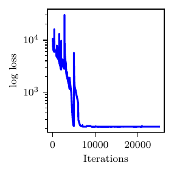
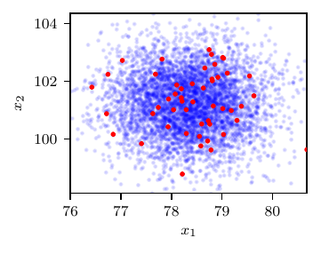

Two-element Windkessel Model
============================

The two-element Windkessel model (often referred to as the **RC** model) is the simplest representation of the human systemic circulation and requires two parameters, i.e., a resistance :math:`R \in [100, 1500]` Barye :math:`\cdot` s/ml and a capacitance :math:`C \in [1\times 10^{-5}, 1 \times 10^{-2}]` ml/Barye. 

We provide a periodic time history of the aortic flow (see :cite:p:`wang2022variational` for additional details) and use the RC model to predict the time history of the proximal pressure :math:`P_{p}(t)`, specifically its maximum, minimum and average values over a typical heart cycle, while assuming the distal resistance :math:`P_{d}(t)` as a constant in time, equal to 55 mmHg.

In our experiment, we set the true resistance and capacitance as :math:`z_{K,1}^{*}=R^{*} = 1000` Barye:math:`\cdot` s/ml and :math:`z_{K,2}^{*}=C^{*} = 5\times 10^{-5}` ml/Barye and determine :math:`P_{p}(t)` from a RK4 numerical solution of the following algebraic-differential system

.. math::
   Q_{d} = \frac{P_{p}-P_{d}}{R},\quad \frac{d P_{p}}{d t} = \frac{Q_{p} - Q_{d}}{C},
   :label: equ:RC

where :math:`Q_{p}` is the flow entering the RC system and :math:`Q_{d}` is the distal flow.

Synthetic observations are generated by adding Gaussian noise to the true model solution :math:`\boldsymbol{x}^{*}=(x^{*}_{1},x^{*}_{2},x^{*}_{3})=(P_{p,\text{min}},` :math:`P_{p,\text{max}},` :math:`P_{p,\text{avg}})= (78.28, 101.12,  85.75)`, i.e., :math:`\boldsymbol{x}` follows a multivariate Gaussian distribution with mean :math:`\boldsymbol{x}^{*}` and a diagonal covariance matrix with entries :math:`0.05\,x_{i}^{*}`, where :math:`i=1,2,3` corresponds to the maximum, minimum, and average pressures, respectively. 

The aim is to quantify the uncertainty in the RC model parameters given 50 repeated pressure measurements. We imposed a non-informative prior on :math:`R` and :math:`C`. Results are shown in :numref:`fig_rc_res`.

.. figure:: imgs/rc/target_plot_rc-1.png

   Results from the RC model. Loss profile (top), posterior samples (center) for R and C and the posterior predictive distribution (bottom) for :math:`P_{p,\text{min}}` and :math:`P_{p,\text{max}}` (right, :math:`P_{p,\text{avg}}` not shown).

An implementation of this model can be found below.

.. literalinclude:: /../linfa/tests/test_linfa.py
   :pyobject: linfa_test_suite.rc_example
