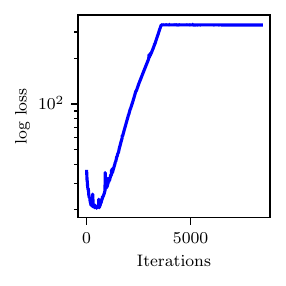
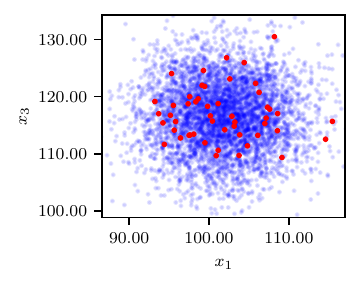

Three-element Wndkessel Model
=============================

The three-parameter Windkessel or **RCR** model is characterized by proximal and distal resistance parameters :math:`R_{p}, R_{d} \in [100, 1500]` Barye :math:`\cdot` s/ml and one capacitance parameter :math:`C \in [1\times 10^{-5}, 1\times 10^{-2}]` ml/Barye.

This model is not identifiable. The average distal pressure is only affected by the total system resistance, i.e. the sum :math:`R_{p}+R_{d}`, leading to a negative correlation between these two parameters. Thus, an increment in the proximal resistance is compensated by a reduction in the distal resistance (so the average distal pressure remains the same) which, in turn, reduces the friction encountered by the flow exiting the capacitor. An increase in the value of :math:`C` is finally needed to restore the average, minimum and maximum pressure. This leads to a positive correlation between :math:`C` and :math:`R_{d}`.

The output consists of the maximum, minimum and average values of the proximal pressure :math:`P_{p}(t)`, i.e., :math:`(P_{p,\text{min}}, P_{p,\text{max}}, P_{p,\text{avg}})` over one heart cycle. The true parameters are :math:`z^{*}_{K,1} = R^{*}_{p} = 1000` Barye :math:`\cdot` s/ml, :math:`z^{*}_{K,2}=R^{*}_{d} = 1000` Barye :math:`\cdot` s/ml and :math:`C^{*} = 5\times 10^{-5}` ml/Barye and the proximal pressure is computed from the solution of the algebraic-differential system

.. math::
   Q_{p} = \frac{P_{p} - P_{c}}{R_{p}},\quad Q_{d} = \frac{P_{c}-P_{d}}{R_{d}},\quad \frac{d\, P_{c}}{d\,t} = \frac{Q_{p}-Q_{d}}{C},

where the distal pressure is set to :math:`P_{d}=55` mmHg.

Synthetic observations are generated from :math:`N(\boldsymbol\mu, \boldsymbol\Sigma)`, where :math:`\mu=(f_{1}(\boldsymbol{z}^{*}),f_{2}(\boldsymbol{z}^{*}),f_{3}(\boldsymbol{z}^{*}))^T = (P_{p,\text{min}}, P_{p,\text{max}}, P_{p,\text{ave}})^T = (100.96, 148.02,116.50)^T` and :math:`\boldsymbol\Sigma`` is a diagonal matrix with entries :math:`(5.05, 7.40, 5.83)^T`. The budgeted number of true model solutions is 216; the fixed surrogate model is evaluated on a :math:`6\times 6\times 6 = 216` pre-grid while the adaptive surrogate is evaluated with a pre-grid of size :math:`4\times 4\times 4 = 64` and the other 152 evaluations are adaptively selected.

This example also demonstrates how NoFAS can be combined with annealing for improved convergence. The results in :numref:`fig_rcr_res` are generated using the AdaAnn adaptive annealing scheduler with intial inverse temperature :math:`t_{0}=0.05`, KL tolerance :math:`\tau=0.01` and a batch size of 100 samples. The number of parameter updates is set to 500, 5000 and 5 for :math:`t_{0}`, :math:`t_{1}` and :math:`t_{0}<t<t_{1}`, respectively and 1000 Monte Carlo realizations are used to evaluate the denominator in :eq:`eqn:friedman1`. Use of annealing explains why the loss function is increasing (the posterior distribution becomes increasingly less smooth) instead of monotonically descreasing as for the other examples. The posterior samples capture well the nonlinear correlation among the parameters and generate a fairly accurate posterior predictive distribution that overlaps with the observations. Additional details can be found in :cite:p:`wang2022variational,cobian2023adaann`.

.. figure:: imgs/rcr/data_plot_rcr_nofas_adaann_8400_0_1-1.png

.. figure:: imgs/rcr/params_plot_rcr_nofas_adaann_8400_0_1-1.png
.. figure:: imgs/rcr/params_plot_rcr_nofas_adaann_8400_0_2-1.png
.. figure:: imgs/rcr/params_plot_rcr_nofas_adaann_8400_1_2-1.png
   :name: fig_rcr_res

   Results from the RCR model. Loss profile (top), posterior predictive distribution (center) and posterior samples (bottom).

An implementation of this model can be found below.

.. literalinclude:: /../linfa/tests/test_linfa.py
   :pyobject: linfa_test_suite.rcr_example

