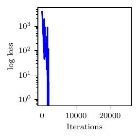
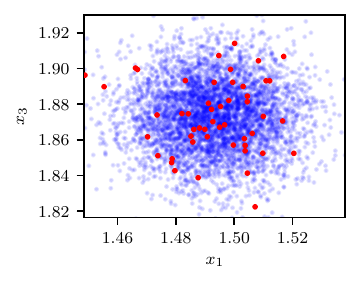
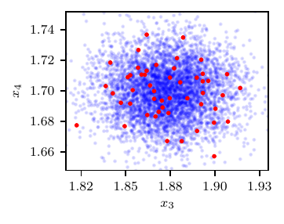
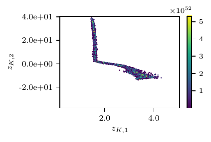

High-dimensional Sobol' Function
================================

We consider a map :math:`f: \mathbb{R}^{5}\to\mathbb{R}^{4}` expressed as

.. math::
   f(\boldsymbol{z}) = \boldsymbol{A}\,\boldsymbol{g}(e^{\boldsymbol{z}}),

where :math:`g_i(\boldsymbol{r}) = (2\cdot |2\,a_{i} - 1| + r_i) / (1 + r_i)` with :math:`r_i > 0` for :math:`i=1,\dots,5` is the **Sobol** function :cite:p:`sobol2003theorems` and :math:`\boldsymbol{A}` is a :math:`4\times5` matrix. We also set

.. math::
   \boldsymbol{a} = (0.084, 0.229, 0.913, 0.152, 0.826)^T \mbox{ and }\boldsymbol{A} = \frac{1}{\sqrt{2}}
   \begin{pmatrix}
   1 & 1 & 0 & 0 & 0\\
   0 & 1 & 1 & 0 & 0\\
   0 & 0 & 1 & 1 & 0\\
   0 & 0 & 0 & 1 & 1\\
   \end{pmatrix}.

The true parameter vector is set at :math:`\boldsymbol{z}^{*} = (2.75,-1.5, 0.25,-2.5,1.75)^T`. While the Sobol function is bijective and analytic, :math:`f` is over-parameterized and non identifiabile.

This is also confirmed by the fact that the curve segment :math:`\gamma(t) = g^{-1}(g(\boldsymbol z^*) + \boldsymbol v\,t)\in Z` gives the same model solution as :math:`\boldsymbol{x}^{*} = f(\boldsymbol{z}^{*}) = f(\gamma(t)) \approx (1.4910,1.6650,1.8715,1.7011)^T` for :math:`t \in (-0.0153, 0.0686]`, where :math:`\boldsymbol v = (1,-1,1,-1,1)^T`. This is consistent with the one-dimensional null-space of the matrix :math:`\boldsymbol A`. We also generate synthetic observations from the Gaussian distribution

.. math::
   \boldsymbol{x} = \boldsymbol{x}^{*} + 0.01\cdot |\boldsymbol{x}^{*}| \odot \boldsymbol{x}_{0},\,\,\text{and}\,\,\boldsymbol{x}_{0} \sim \mathcal{N}(0,\boldsymbol I_5).

Results are shown in :numref:`fig_highdim`.

.. figure:: imgs/highdim/params_plot_highdim_25000_1_2-1.png
.. figure:: imgs/highdim/params_plot_highdim_25000_3_4-1.png
   :name: fig_highdim

   Results from the high-dimensional model. Loss profile and representative plots for the posterior samples and posterior predictive distribution are shown.

An implementation of this model can be found below.

.. literalinclude:: /../linfa/tests/test_linfa.py
   :pyobject: linfa_test_suite.highdim_example

