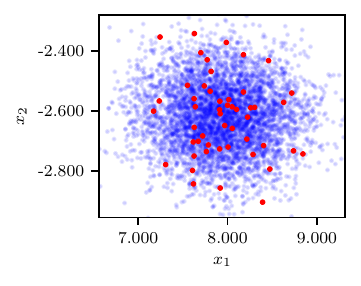

Simple two-dimensional map with Gaussian likelihood
===================================================

A model :math:`f:\mathbb{R}^{2}\to \mathbb{R}^{2}` is chosen in this experiment having the closed-form expression

.. math::
   f(\boldsymbol z) = f(z_{1},z_{2}) = (z_1^3 / 10 + \exp(z_2 / 3), z_1^3 / 10 - \exp(z_2 / 3))^T.

Observations :math:`\boldsymbol{x}` are generated as

.. math::
   \boldsymbol{x} = \boldsymbol{x}^{*} + 0.05\,|\boldsymbol{x}^{*}|\,\odot\boldsymbol{x}_{0},
   :label: eqn:exp1

where :math:`\boldsymbol{x}_{0} \sim \mathcal{N}(0,\boldsymbol I_2)` and :math:`\odot` is the Hadamard product. We set the **true model** parameters at :math:`\boldsymbol{z}^{*} = (3, 5)^T`, with output :math:`\boldsymbol{x}^{*} = f(\boldsymbol z^{*})=(7.99, -2.59)^{T}`, and simulate 50 sets of observations from :eq:`eqn:exp1`. The likelihood of :math:`\boldsymbol z` given :math:`\boldsymbol{x}` is assumed Gaussian and we adopt a noninformative uniform prior :math:`p(\boldsymbol z)`. We allocate a budget of :math:`4\times4=16` model solutions to the pre-grid and use the rest to adaptively calibrate :math:`\widehat{f}` using 2 samples every 1000 normalizing flow iterations.

Results in terms of loss profile, variational approximation and posterior predictive distribution are shown in :numref:`fig_trivial`.

.. _fig_trivial:

.. figure:: imgs/trivial/log_plot_trivial-1.png
.. figure:: imgs/trivial/target_plot_trivial-1.png

   Results from the trivial model. Loss profile (top), posterior samples (center) and posterior predictive distribution (bottom).
